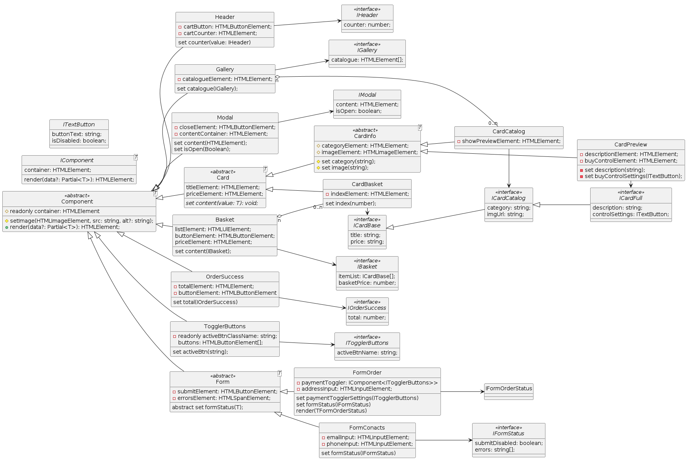

# Проектная работа "Веб-ларек"

Стек: HTML, SCSS, TS, Vite

Структура проекта:

-  src/ -- исходные файлы проекта

-  src/components/ -- папка с JS компонентами

-  src/components/base/ -- папка с базовым кодом

Важные файлы:

-  index.html -- HTML-файл главной страницы

-  src/types/index.ts -- файл с типами

-  src/main.ts -- точка входа приложения

-  src/scss/styles.scss -- корневой файл стилей

-  src/utils/constants.ts -- файл с константами

-  src/utils/utils.ts -- файл с утилитами

## Установка и запуск

Для установки и запуска проекта необходимо выполнить команды

```
npm install
npm run dev
```

или

```
yarn
yarn dev
```

## Сборка

```
npm run build
```

или

```
yarn build
```

# Интернет-магазин «Web-Larёk»

«Web-Larёk» -- это интернет-магазин с товарами для веб-разработчиков, где пользователи могут просматривать товары, добавлять их в корзину и оформлять заказы. Сайт предоставляет удобный интерфейс с модальными окнами для просмотра деталей товаров, управления корзиной и выбора способа оплаты, обеспечивая полный цикл покупки с отправкой заказов на сервер.

## Архитектура приложения

Код приложения разделен на слои согласно парадигме MVP (Model-View-Presenter), которая обеспечивает четкое разделение ответственности между классами слоев Model и View. Каждый слой несет свой смысл и ответственность:

Model - слой данных, отвечает за хранение и изменение данных.\
View - слой представления, отвечает за отображение данных на странице.\
Presenter - презентер содержит основную логику приложения и  отвечает за связь представления и данных.

Взаимодействие между классами обеспечивается использованием событийно-ориентированного подхода. Модели и Представления генерируют события при изменении данных или взаимодействии пользователя с приложением, а Презентер обрабатывает эти события используя методы как Моделей, так и Представлений.

### Базовый код

#### Класс Component

Является базовым классом для всех компонентов интерфейса. Класс является дженериком и принимает в переменной `T` тип данных, которые могут быть переданы в метод `render` для отображения.

Конструктор:\
`constructor(container: HTMLElement)` - принимает ссылку на DOM элемент за отображение, которого он отвечает.

Поля класса:\
`container: HTMLElement` - поле для хранения корневого DOM элемента компонента.

Методы класса:\
`render(data?: Partial<T>): HTMLElement` - Главный метод класса. Он принимает данные, которые необходимо отобразить в интерфейсе, записывает эти данные в поля класса и возвращает ссылку на DOM-элемент. Предполагается, что в классах, которые будут наследоваться от `Component` будут реализованы сеттеры для полей с данными, которые будут вызываться в момент вызова `render` и записывать данные в необходимые DOM элементы.\
`setImage(element: HTMLImageElement, src: string, alt?: string): void` - утилитарный метод для модификации DOM-элементов ``

#### Класс Api

Содержит в себе базовую логику отправки запросов.

Конструктор:\
`constructor(baseUrl: string, options: RequestInit = {})` - В конструктор передается базовый адрес сервера и опциональный объект с заголовками запросов.

Поля класса:\
`baseUrl: string` - базовый адрес сервера\
`options: RequestInit` - объект с заголовками, которые будут использованы для запросов.

Методы:\
`get(uri: string): Promise<object>` - выполняет GET запрос на переданный в параметрах ендпоинт и возвращает промис с объектом, которым ответил сервер\
`post(uri: string, data: object, method: ApiPostMethods = 'POST'): Promise<object>` - принимает объект с данными, которые будут переданы в JSON в теле запроса, и отправляет эти данные на ендпоинт переданный как параметр при вызове метода. По умолчанию выполняется `POST` запрос, но метод запроса может быть переопределен заданием третьего параметра при вызове.\
`handleResponse(response: Response): Promise<object>` - защищенный метод проверяющий ответ сервера на корректность и возвращающий объект с данными полученный от сервера или отклоненный промис, в случае некорректных данных.

#### Класс EventEmitter

Брокер событий реализует паттерн "Наблюдатель", позволяющий отправлять события и подписываться на события, происходящие в системе. Класс используется для связи слоя данных и представления.

Конструктор класса не принимает параметров.

Поля класса:\
`_events: Map<string | RegExp, Set<Function>>)` -  хранит коллекцию подписок на события. Ключи коллекции - названия событий или регулярное выражение, значения - коллекция функций обработчиков, которые будут вызваны при срабатывании события.

Методы класса:\
`on<T extends object>(event: EventName, callback: (data: T) => void): void` - подписка на событие, принимает название события и функцию обработчик.\
`emit<T extends object>(event: string, data?: T): void` - инициализация события. При вызове события в метод передается название события и объект с данными, который будет использован как аргумент для вызова обработчика.\
`trigger<T extends object>(event: string, context?: Partial<T>): (data: T) => void` - возвращает функцию, при вызове которой инициализируется требуемое в параметрах событие с передачей в него данных из второго параметра.

### Данные

#### Интерфейс IProduct

Определяет набор полей отдельного Товара. Используется для единого представления данных о товаре в разных частях приложения.

```typescript
interface IProduct {
  id: string;
  description: string;
  image: string;
  title: string;
  category: string;
  price: number | null;
}
```

`id: string` - уникальный идентификатор товара в приложении;

`description: string` - текстовое описание товара;

`image: string` - ссылка на изображение товара;

`title: string` - название товара

`category: string` - категория товара

`price: number | null` - цена товара

#### Интерфейс IByer

Определяет набор полей для работы с данными покупателя при заказе

```typescript
interface IBuyer {
  payment: TPayment = "";
  email: string;
  phone: string;
  address: string;
}
```

`payment: TPayment` - выбранный покупателем вид оплаты. Принимает одно из предопределенных в `TPayment` значений, например «Card» или «Cash».

`email: string` -  указанный покупателем email;

`phone: string` - указанный покупателем номер телефона;

`address: string` - указанный покупателем адрес доставки.

#### Собственные типы данных

`type TPayment = "Card" | "Cash" | ""`\- вид оплаты - набор предопределенных значений для выбора пользователем

```
TValidationRules<T> = {
    [key in keyof T]: {
        validateFn: () => boolean;
        message: string;
    };
};
```

\- обобщенный тип данных, принимает в параметр T интерфейс или тип данных в виде объекта, позволяет хранить правила для каждого ключа принятого объекта:

\-  `validateFn: ()=>boolean;` - функция валидации поля

\-  `message: string` - текстовое сообщение

```
TValidationErrorMessages<T> = {
  [key in keyof T]: string;
}
```

\- обобщенный тип данных, принимает в параметр T интерфейс или тип данных в виде объекта, позволяет хранить объект с ключами принятого объекта и текстовыми сообщениями об ошибках валидации для этого ключа.

### Модели данных

#### Класс Catalogue (Каталог)

Отвечает за хранение списка товаров и выбранного товара, устанавливает логику работы со списком товаров в каталоге/

**Конструктор:**

Конструктор класса не принимает параметров.

**Поля:**

`products: IProduct[] = []` - массив товаров в каталоге. По умолчанию установлен пустой массив;

`selectedProduct?: IProduct | null = null` -  выбранный к просмотру товар. По умолчанию null.

**Методы:**

`setProducts(products: IProduct[]) :void` - принимает массив товаров и записывает его в экземпляр каталога;

`setSelectedProduct(product: IProduct): void` - записывает объект данных товара полученный в аргументе в поле SelectedProduct;

`getProducts():IProduct[]`  - возвращает массив товаров из Каталога;

`getSelectedProduct(): IProduct | null` - возвращает объект с данными выбранного к просмотру товара из поля SelectedProduct, при отсутствии выбранного товара, возвращает null;

`getProductById(id: string): IProduct` - возвращает из каталога объект данных товара с полученным в аргументе id.

#### Класс Cart (Корзина)

Отвечает за хранение товаров в корзине, получение данных о содержимом корзины и устанавливает логику управления товарами в корзине: добавление, удаление.

**Поля:**

`products: IProduct[] = []` - массив товаров, добавленных в корзину, по умолчанию пустой массив.

**Конструктор**

Конструктор класса не принимает параметров.

**Методы**

`getProducts(): IProduct[]`   - возвращает массив товаров, содержащихся в корзине пользователя;

`addProduct(product: IProduct[]): void`  - принимает объект товара, выбранного для добавления, записывает его в массив товаров экземпляра корзины;

`removeProduct(id: string): void`  - удаляет товар с полученным в аргументе id из массива товаров экземпляра корзины;

`clearProducts() : void` - удаляет все товары из корзины;

`getFullCost() : number` - возвращает полную стоимость всех товаров в корзине;

`getProductsCount() - number` - возвращает количество товаров, добавленных в корзину;

`hasProduct(id: string) : boolean` - проверяет добавлен ли товар в корзину, возвращает true при положительном результате, false - если товара в корзине нет;

#### Класс Buyer

Отвечает за хранение и устанавливает логику использование данных покупателя при заказе.

**Поля:**

`data: IBuyer = { payment: "", email: "", phone: "", address: "" }`\- объект с данными Покупателя по форме установленной в интерфейсе IBuyer. По умолчанию все значения в объекте - пустые строки.

`validationRules: TValidationRules<IBuyer>` - поле только для чтения - объект, содержащий правила валидации поля data класса. Осован на дженерик-типе данных.

```
private readonly validationRules: TValidationRules<IBuyer> = {
    payment: {
        validateFn: () => isFilledString(this.data.payment.toString()),
        message: "Необходимо укаазать вид оплаты",
    },
    email: {
        validateFn: () => isFilledString(this.data.email),
        message: "Необходимо укаазать email",
    },
    phone: {
        validateFn: () => isFilledString(this.data.phone),
        message: "Необходимо укаазать номер телефона",
    },
    address: {
        validateFn: () => isFilledString(this.data.address),
        message: "Необходимо укаазать номер адрес",
    },
};
```

**Конструктор**

Конструктор класса не принимает параметров.

**Методы**

`setData(fields: Partial<IBuyer>): void` - принимает объект с полученными значениями данных Покупателя и записывает их в модель.

`getData(): IBuyer` - позволяет получить все сохраненные данные Покупателя

`clearData(): void` - очищает все сохраненные данные Покупателя

`validateData(): Partial<TValidationErrorMessages<IBuyer>>` - проверяет поля экземпляра класса и возвращает объект с описаниями полученных ошибок валидации.

### Слой коммуникации

#### Интерфейс IOrder

Определяет набор полей при отправке запроса с заказом на сервер

```typescript

interface IOrder extends IBuyer { total: number; items: IProduct["id"][]; }
```

`IBuyer` \- объект с данными покупателя total: number - суммарная стоимость всех товаров в заказе `items: IProduct["id"][]` \- массив с id товаров в заказе

#### Интерфейс IProductResponse

Типизирует данные, получаемые от сервера в ответ на запрос товаров каталога

```typescript

interface IProductResponse { total: number; items: IProduct[]; }
```

`total: number` - количество товаров в ответе items: IProduct\[\] - массив товаров

#### Интерфейс IOrderResponse

Типизирует данные, получаемые от сервера в ответ на запрос с заказом

```typescript

interface IOrderResponse { id: string; total: number; }
```

`id: string` - id заказа;

`total: number` - итоговая сумма оплаты/

#### Класс ProductApi

Класс отвечает за отправку запросов на основные ендпойнты сервера. Реализует интерфейс IApi для композиции с классом Api **Поля:**

`api: IApi` - объект, содержащий методы api

`productsUri: string` - ендпойнт ресурса со списком товаров

`orderUri: string` - ендпойнт ресурса для размещения заказа

**Конструктор:**

`constructor(api: IApi)` - принимает объект, содержащий методы api (например, экземпляр класса Api)

**Методы:**

`getProducts(): Promise<IProduct[]>` - запрашивает данные со списком товаров с сервера, возвращает промис ответа сервера со списком товаров;

`sendOrder(): Promise<IOrderResponse>` \- отправляет запрос на создание заказа. возвращает промис ответа сервера.

### Слой представления
- Компонент `Gallery` содержит множество карточек `CardCatalog` (агрегация «0..n»).
- Компонент `Basket` содержит множество карточек `CardBasket` (агрегация «0..n»).
- Компонент `FormOrder` использует `TogglerButtons` через композицию.
- Все компоненты генерируют события (через `EventEmitter`), которые обрабатываются презентером.

#### Диаграмма классов



#### Интерфейсы представления

Для типизации данных, передаваемых в компоненты, определены следующие интерфейсы:

- **IComponent &lt;T&gt;** – общий интерфейс для всех компонентов. Может быть использован для типизации компонентов в композиции, но не является обязательным для наследования.
  ```typescript
  interface IComponent<T> {
      container: HTMLElement;
      render(data?: Partial<T>): HTMLElement;
  }
  ```

- **IHeader** – данные для компонента Header:
  ```typescript
  interface IHeader {
      counter: number; // количество товаров в корзине
  }
  ```

- **IGallery** – данные для компонента Gallery:
  ```typescript
  interface IGallery {
      catalogue: HTMLElement[]; // массив DOM-элементов карточек каталога
  }
  ```

- **IModal** – данные для модального окна:
  ```typescript
  interface IModal {
      content: HTMLElement; // содержимое модального окна
      isOpen: boolean;      // состояние открытия
  }
  ```

- **ICardBase** – базовые данные карточки товара:
  ```typescript
  interface ICardBase {
      title: string;  // заголовок
      price: string;  // цена в виде строки (с валютой)
  }
  ```

- **ICardCatalog** – данные карточки товара в каталоге (расширяет ICardBase):
  ```typescript
  interface ICardCatalog extends ICardBase {
      category: string; // категория товара
      imgUrl: string;   // URL изображения
  }
  ```

- **ITextButton** – настройки текстовой кнопки:
  ```typescript
  interface ITextButton {
      buttonText: string;   // текст на кнопке
      isDisabled: boolean;  // доступность кнопки
  }
  ```

- **ICardFull** – полные данные карточки товара (используется в CardPreview) наследует поля из ICardCatalog :
  ```typescript
  interface ICardFull extends ICardCatalog {
      description: string;       // описание товара
      buyControlSettings: ITextButton; // настройки кнопки 
  }
  ```

- **IOrderSuccess** – данные для компонента успешного заказа:
  ```typescript
  interface IOrderSuccess {
      total: number; // итоговая сумма заказа
  }
  ```

- **IBasket** – данные для компонента корзины:
  ```typescript
  interface IBasket {
      itemList: ICardBase[]; // список товаров (базовые данные)
      basketPrice: number;   // общая стоимость
  }
  ```

- **IFormStatus** – статус формы (общий):
  ```typescript
  interface IFormStatus {
      submitDisabled: boolean; // доступность кнопки отправки
      errors: string[];        // список ошибок
  }
  ```

- **ITogglerButtons** – состояние переключателя кнопок:
  ```typescript
  interface ITogglerButtons {
      activeBtnName: string; // имя активной кнопки
  }
  ```

- **TFormOrderStatus** – составной статус формы заказа (пересечение типов):
  ```typescript
  type TFormOrderStatus = IFormStatus & ITogglerButtons;
  ```

#### Классы компонентов

Все компоненты наследуются от базового класса `Component<T>`, где `T` – соответствующий интерфейс данных.

#### Абстрактный класс Card&lt;T&gt;

Базовый класс для всех карточек товара.

**Поля:**
- `titleElement: HTMLElement` – элемент заголовка
- `priceElement: HTMLElement` – элемент цены

**Методы:**
- `set content(value: T): void` – абстрактный сеттер для обновления данных карточки

#### Абстрактный класс CardInfo&lt;T&gt;

Наследует `Card<T>` и добавляет работу с изображением и категорией.

**Поля:**
- `categoryElement: HTMLElement` – элемент категории
- `imageElement: HTMLImageElement` – элемент изображения

**Методы (защищённые):**
- `set category(value: string): void` – устанавливает категорию
- `set image(value: string): void` – устанавливает изображение (использует `setImage` из `Component`)


#### Класс Header
 – отображает логотип и счётчик товаров в корзине.
   **Поля:**
    `cartButton: HTMLButtonElement`
    `cartCounter: HTMLElement`
   **Сеттер:** 
   `set counter(value: IHeader)` – обновляет счётчик

#### Класс Gallery
 – контейнер для карточек каталога.
   - **Поля:** `catalogueElement: HTMLElement`
   - **Сеттер:** `set catalogue(value: IGallery)` – заполняет каталог карточками `CardCatalog`

#### Класс Modal
– управляет модальным окном.
   - **Поля:** `closeElement: HTMLButtonElement`, `contentContainer: HTMLElement`
   - **Сеттеры:** `set content(value: HTMLElement)`, `set isOpen(value: boolean)` – управляют содержимым и видимостью

#### Класс CardCatalog
– карточка товара в каталоге (наследует `CardInfo<ICardCatalog>`).
   - **Поля:** `showPreviewElement: HTMLElement` – элемент для открытия предпросмотра
   - **Сеттер:** `set content(value: ICardCatalog)` – заполняет данные карточки

#### Класс CardPreview
– карточка товара в режиме предпросмотра (наследует `CardInfo<ICardFull>`).
   - **Поля:** `descriptionElement: HTMLElement`, `buyControlElement: HTMLElement`
   - **Сеттеры:** `set description(value: string)`, `set buyControlSettings(value: ITextButton)` – управляют описанием и кнопкой

#### Класс CardBasket
– карточка товара в корзине (наследует `Card<ICardBase>`).

   **Поля:** 

   `indexElement: HTMLElement` – элемент номера позиции

   **Сеттер:** 
   
   `set index(value: number)` – устанавливает порядковый номер

#### Класс Basket
– компонент корзины, отображает список товаров и общую стоимость.
   
   **Поля:**

   `listElement: HTMLUListElement` -, 

   `buttonElement: HTMLButtonElement`, 

   `priceElement: HTMLElement`

   **Сеттеры:** 
   
   `set content(value: IBasket)` – обновляет список и стоимость

#### Класс OrderSuccess
– сообщение об успешном оформлении заказа.
  **Поля:** 

   `totalElement: HTMLElement`,

   `buttonElement: HTMLButtonElement`

   **Сеттер:** 
   
   `set total(value: IOrderSuccess)` – устанавливает итоговую сумму

#### Класс TogglerButtons
– компонент переключателя кнопок (например, выбор способа оплаты).
   
   **Поля:**

   `buttons: HTMLButtonElement[]`,

   `activeBtnClassName: string`

   **Сеттер:**
   
   `set activeBtn(value: string)` – устанавливает активность кнопок по имени

#### Класс Form&lt;T&gt;

**Поля:**

`submitElement: HTMLButtonElement`,

`errorsElement: HTMLSpanElement`

**Абстрактный сеттер:** 

`set formStatus(value: T): void` – обновляет состояние формы

#### Класс FormOrder
– форма выбора способа оплаты и адреса доставки (наследует `Form<TFormOrderStatus>`). Использует `TogglerButtons` через композицию.

**Поля:**

`paymentToggler: IComponent<ITogglerButtons>` (композиция), 

`addressInput: HTMLInputElement`

**Сеттеры:**

`set paymentTogglerSettings(value: ITogglerButtons)`,

`set formStatus(value: IFormStatus)`

#### Класс FormContacts
– форма ввода контактных данных (наследует `Form<IFormStatus>`).

**Поля:**
`emailInput: HTMLInputElement` -,

`phoneInput: HTMLInputElement`

**Сеттер:** 

`set formStatus(value: IFormStatus)` – обновляет состояние формы

