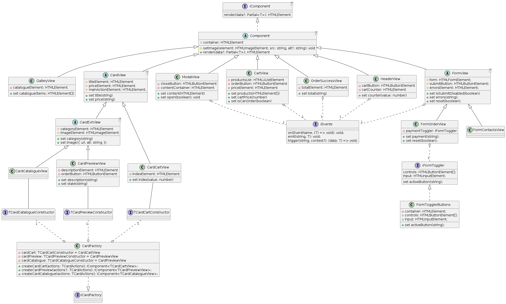

# Проектная работа "Веб-ларек"

Стек: HTML, SCSS, TS, Vite

Структура проекта:

- src/ -- исходные файлы проекта

- src/components/ -- папка с JS компонентами

- src/components/base/ -- папка с базовым кодом

- src/components/view/ -- папка с компонентами Представления

- src/components/models/ -- папка с компонентами Млдели двнных

- src/components/presenter/ -- папка с Презентером

- src/components/api/ -- папка с компонентами слоя коммуникации

Важные файлы:

- index.html -- HTML-файл главной страницы

- src/types/index.ts -- файл с типами

- src/main.ts -- точка входа приложения

- src/scss/styles.scss -- корневой файл стилей

- src/utils/constants.ts -- файл с константами

- src/utils/utils.ts -- файл с утилитами

## Установка и запуск

Для установки и запуска проекта необходимо выполнить команды

```
npm install
npm run dev
```

или

```
yarn
yarn dev
```

## Сборка

```
npm run build
```

или

```
yarn build
```

# Интернет-магазин «Web-Larёk»

«Web-Larёk» -- это интернет-магазин с товарами для веб-разработчиков, где пользователи могут просматривать товары, добавлять их в корзину и оформлять заказы. Сайт предоставляет удобный интерфейс с модальными окнами для просмотра деталей товаров, управления корзиной и выбора способа оплата, обеспечивая полный цикл покупки с отправкой заказов на сервер.

## Архитектура приложения

Код приложения разделен на слои согласно парадигме MVP (Model-View-Presenter), которая обеспечивает четкое разделение ответственности между классами слоев Model и View. Каждый слой несет свой смысл и ответственность:

Model - слой данных, отвечает за хранение и изменение данных.\
View - слой представления, отвечает за отображение данных на странице.\
Presenter - презентер содержит основную логику приложения и отвечает за связь представления и данных.

Взаимодействие между классами обеспечивается использованием событийно-ориентированного подхода. Модели и Представления генерируют события при изменении данных или взаимодействии пользователя с приложением, а Презентер обрабатывает эти события используя методы как Моделей, так и Представлений.

### Базовый код

#### Класс Component

Является базовым классом для всех компонентов интерфейса. Класс является дженериком и принимает в переменной `T` тип данных, которые могут быть переданы в метод `render` для отображения.

Конструктор:\
`constructor(container: HTMLElement)` - принимает ссылку на DOM элемент за отображение, которого он отвечает.

Поля класса:\
`container: HTMLElement` - поле для хранения корневого DOM элемента компонента.

Методы класса:\
`render(data?: Partial<T>): HTMLElement` - Главный метод класса. Он принимает данные, которые необходимо отобразить в интерфейсе, записывает эти данные в поля класса и возвращает ссылку на DOM-элемент. Предполагается, что в классах, которые будут наследоваться от `Component` будут реализованы сеттеры для полей с данными, которые будут вызываться в момент вызова `render` и записывать данные в необходимые DOM элементы.\
`setImage(element: HTMLImageElement, src: string, alt?: string): void` - утилитарный метод для модификации DOM-элементов ``

#### Класс Api

Содержит в себе базовую логику отправки запросов.

Конструктор:\
`constructor(baseUrl: string, options: RequestInit = {})` - В конструктор передается базовый адрес сервера и опциональный объект с заголовками запросов.

Поля класса:\
`baseUrl: string` - базовый адрес сервера\
`options: RequestInit` - объект с заголовками, которые будут использованы для запросов.

Методы:\
`get(uri: string): Promise<object>` - выполняет GET запрос на переданный в параметрах ендпоинт и возвращает промис с объектом, которым ответил сервер\
`post(uri: string, data: object, method?: ApiPostMethods = 'POST'): Promise<object>` - принимает объект с данными, которые будут переданы в JSON в теле запроса, и отправляет эти данные на ендпоинт переданный как параметр при вызове метода. По умолчанию выполняется `POST` запрос, но метод запроса может быть переопределен заданием третьего параметра при вызове.\
`handleResponse(response: Response): Promise<object>` - защищенный метод проверяющий ответ сервера на корректность и возвращающий объект с данными полученный от сервера или отклоненный промис, в случае некорректных данных.

#### Класс EventEmitter

Брокер событий реализует паттерн "Наблюдатель", позволяющий отправлять события и подписываться на события, происходящие в системе. Класс используется для связи слоя данных и представления.

Конструктор класса не принимает параметров.

Поля класса:\
`_events: Map<string | RegExp, Set<Function>>)` - хранит коллекцию подписок на события. Ключи коллекции - названия событий или регулярное выражение, значения - коллекция функций обработчиков, которые будут вызваны при срабатывании события.

Методы класса:\
`on<T extends object>(event: EventName, callback: (data: T) => void): void` - подписка на событие, принимает название события и функцию обработчик.\
`emit<T extends object>(event: string, data?: T): void` - инициализация события. При вызове события в метод передается название события и объект с данными, который будет использован как аргумент для вызова обработчика.\
`trigger<T extends object>(event: string, context?: Partial<T>): (data: T) => void` - возвращает функцию, при вызове которой инициализируется требуемое в параметрах событие с передачей в него данных из второго параметра.

### Данные
- Методы запросов к API `type ApiPostMethods = "POST" | "PUT" | "DELETE";`
- *Интерфейс базового API*
    ```typescript
    export interface IApi {
        get<T extends object>(uri: string): Promise<T>;
        post<T extends object>(
            uri: string,
            data: object,
            method?: ApiPostMethods,
        ): Promise<T>;
    }
    ```

 - Вид оплаты в модели Buyer - набор предопределенных значений для выбора пользователем
`export type TPayment = "cash" | "online" | "";`
 - Вид оплаты в представлении FormOrderView 
`export type TOrderPayment = "cash" | "card" | "";`
 - Объект для приведения типов платежей в модели Buyer и в форме FormOrderView
`export type TPaymentMap = Record<TPayment, TOrderPayment>`

 - определяет набор полей отдельного Товара в модели Catalogue.
    ```typescript
    export interface IProduct {
        id: string;
        description: string;
        image: string;
        title: string;
        category: string;
        price: number | null;
    }
    ```
 -  Данные, отправляемые моделью Cart с событием model:cart:update 
    ```typescript
    export type TCartData = {
        products: IProduct[]; // массив товаров корзины
        price: number; // общая цена товаров в корзине
        count?: number; // количество товаров в корзине
    }
    ```
 -  Данные покупателя 
    ```typescript
    export interface IBuyer {
        payment: TPayment; // вид оплаты
        email: string;
        phone: string;
        address: string;
    }
    ```
 - Тип объекта с правилами валидации полей объекта с типом полученным в T (напр. модели Buyer), требует соответствия ключей ключам T 
    ```typescript
    export type TValidationRules<T> = {
        [key in keyof T]: {
            validateFn: () => boolean;
            message: string;
        };
    };
    ```
 - Тип данных объекта, содержащего сообщения об ошибках, принимает в T другой объект, ключи которого требуется продублировать  
    ```typescript
    export type TValidationErrorMessages<T> = {
        [key in keyof T]: string;
    };
    ```
-  Тип объекта для render форм `export type TFormData = Partial<TFormContacts & TFormOrder>`

 -  Тип данных получаемых при запросе каталога продуктов 
    ```typescript
    export interface IProductResponse {
        total: number;
        items: IProduct[];
    }
    ```
 -  Заказ к отправке на серввер 
    ```typescript
    export interface IOrder extends IBuyer {
        total: number; // - итоговая стоимость товаров в заказе
        items: IProduct["id"][]; // - массив с id товаров в заказзе
    }
    ```
 - Ответ на успешный запрос заказа 
    ```typescript
    export interface IOrderResponse {
        id: string; // id заказа
        total: number; // - итоговая стоимость товаров в заказе
    }
    ```
 - Тип данных для render в шапке сайта
    ```typescript
    export type THeader = {
        counter: number; // количество товаров в корзине
    };
    ```
 - Тип данных для render компонента галереи
    ```typescript
    export type TGallery = {
        catalogue: HTMLElement[]; // массив элементов контента
    };
    ```
 - Базовый тип данных товара приведенный к виду необходимому в карточках
    ```typescript
    export type TCardProduct = {
        title: string;
        price: string;
        category: string;
        image: {
            url: string;
            alt?: string;
        };
        description: string;
    };
    ```
 - Тип с минимальным набором данных для карточки товара
`export type TCardBaseInfo = Pick<TCardProduct, "title" | "price">;`

 - Тип данных для установки в карточку товара изображения и категории
`export type TCardExtInfo = Pick<TCardProduct, "image" | "category">;`

 - Тип, расширяющий данные карточки товара для корзине.
    ```typescript
    export type TCardCartExt = {
        index: number;
    };
    ```
 - Возможные значения состояния кнопки заказа в карточке
`export type TOrderButtonState = "add" | "remove" | "disabled";`
 - Тип данных объекта, устанавливающего соответствие состояния кнопки заказа и текста в ней
`export type TCardStates = Record<TOrderButtonState, string>;`

 - Тип данных для расширения данных карточки превью товара 
    ```typescript
    export type TCardFull = Pick<TCardProduct, "description"> & {
        state: TOrderButtonState;

    };
    ```
*Производные типы данных карточек, содержащие полный набор для отдельного компонента, включая данные родительского класса*
 - Производный тип данных карточки товара для каталога, содержащий полный набор, включая данные родительского класса 
`export type TCardCatalogueView = TCardBaseInfo & TCardExtInfo`
 - Производный тип данных карточки товара для превью, содержащий полный набор, включая данные родительского класса 
`export type TCardPreviewView = TCardBaseInfo & TCardExtInfo & TCardFull`
 - Производный тип данных карточки товара для корзины, содержащий полный набор, включая данные родительского класса 
`export type TCardCartView = TCardBaseInfo & TCardCartExt`


 - Тип данных необходимых для render в CartView
    ```typescript
    export type TCart = {
        products: HTMLElement[]; // массив элементов карточек товара
        cartPrice: string; // итоговая стоимость всей корзины
        isCanOrder: boolean; // доступность покупки
    };
    ```
**Типы для событий**
 - Перечень алиасов для стандартных событий браузера
`export type TStandardEvents = "onClick" | "onChange" | "onSubmit";`

 - Тип данных - функция обработчик стандартного события браузера
`export type TEventHandle = (event: Event) => void;`

 - Тип объекта с набором обработчиков стандартных событий с литералом в ключе
`export type TActions = Record<TStandardEvents, TEventHandle>;`

 - Тип объекта с обработчикaми события для карточки
`export type TCardActions = Pick<TActions, "onClick">;`


 - Тип данных для рендера модального окна
    ```typescript
    export type TModal = {
        content: HTMLElement; //содержимое модального окна
        open: boolean; // модальное окно открыть да/нет
    };
    ```

**Типы для форм**
 -  Объект данных принмаемых в render() FormView
    ```typescript
    export type TFormStatus = {
        isSubmitDisabled: boolean; // - отключить кнопку submit да/нет
        error: string; // - сообщение об ошибках формы
        reset: boolean; // - сбросить форму да/нет
    };
    ```

 -  Объект данных принмаемых в render() FormOrderView 
    ```typescript
    export type TFormPayment = {
        payment: TOrderPayment;
        address: string;
    };
    ```
 - Объект данных принмаемых в render() FormOrderView
     ```typescript
    export type TFormContacts = {
        phone: string;
        email: string;
    }
    ```
 -  Производный тип объединяющий все данные принимаемые FormOrderView, включая типы от класса родителя 
`export type TFormOrder = TFormStatus & TFormPayment`
 -  Производный тип объединяющий все данные принимаемые FormContactsView, включая типы от класса родителя 
`export type TFormContactsView = TFormStatus & TFormContacts`
 -  ТИп данных для render в OrderSuccessView 
    ```typescript
    export type TOrderSuccess = {
        total: string; // Сообщение об итоговой сумме списания
    };
    ```
 **Типы данных и интерфейсы требуемые Презентеру**

 -  Интерфейс модели каталога требуемый Презентеру 
    ```typescript
    export interface ICatalogueModel {
        setProducts(productsList: IProduct[]): void;
        setSelectedProduct(product: IProduct): void;
        getSelectedProduct(): IProduct | null;
    }
    ```
 - Интерфейс модели корзины требуемый Презентеру 
    ```typescript
    export interface ICartModel {
        getProducts(): IProduct[];
        addProduct(product: IProduct): void;
        removeProduct(product: IProduct): void;
        clearProducts(): void;
        getFullCost(): number;
        getProdctsCount(): number;
        hasProduct(id: string): boolean;
    }
    ```
 -  Интерфейс модели данных покупателя требуемый Презентеру 
    ```typescript
    export interface IBuyerModel {
        setData(fields: Partial<IBuyer>): void;
        getData(): IBuyer;
        clearData(): void;
        validateData(): Partial<TValidationErrorMessages<IBuyer>>;
    }
    ```
 - Общий интерфейс требуемый Презентеру от слоя Модель 
    ```typescript
    export interface IModels {
        catalogue: ICatalogueModel;
        cart: ICartModel;
        buyer: IBuyerModel;
    };
    ```
 - Дженерик интерфейс инстанса компонента Представления 
    ```typescript
    export interface IComponent<T> {
        render(data?: Partial<T>): HTMLElement;
    }
    ```
 - Интерфейс Фабрики карточек 
    ```typescript
    export interface ICardFactory {
        createCardCatalogue: (
            actions: TCardActions,
        ) => IComponent<TCardCatalogueView>;
        createCardCart: (actions: TCardActions) => IComponent<TCardCartView>;
    }
    ```
 - Интерфейс требуемый Презентеру от слоя Представления 
    ```typescript
    export interface IView {
        gallery: IComponent<TGallery>;
        modal: IComponent<TModal>;
        header: IComponent<THeader>;
        cardPreview: IComponent<TCardPreviewView>;
        cart: IComponent<TCart>;
        formOrder: IComponent<TFormOrderView>;
        formContacts: IComponent<TFormContactsView>;
        orderSuccess: IComponent<TOrderSuccess>;
        cardFactory: ICardFactory;
    }
    ```
 -  Интерфейс Апи требуемый Презентеру для обмена с сервером 
    ```typescript
    export interface IProductApi {
        getProducts(): Promise<IProduct[]>;
        postOrder(
            items: IProduct["id"][],
            total: number,
            buyer: IBuyer,
        ): Promise<IOrderResponse>;
    }
    ```
**Интерфейсы конструкторов**
 - Интерфейсы конструкторов карточек
     ```typescript
    export interface ICardConstructor<T extends (TCardCatalogueView | TCardCartView)> {
    new (container: HTMLElement, actions: TCardActions): IComponent<T>;
    }
    ```

### Модели данных

#### Класс Catalogue (Каталог)

Отвечает за хранение списка товаров и выбранного товара, устанавливает логику работы со списком товаров в каталоге. Уведомляет подписчиков об изменениях через брокер событий.

Конструктор:

- `constructor(private events: IEvents)` - принимает интерфейс брокера сообщений.

Поля:

- `products: IProduct[] = []` - массив товаров в каталоге. По умолчанию установлен пустой массив;

- `selectedProduct?: IProduct | null = null` - выбранный к просмотру товар. По умолчанию null.

Методы:

- `setProducts(products: IProduct[]) :void` - принимает массив товаров и записывает его в экземпляр каталога. Эмитирует событие `model:catalogue:update` с данными товаров обновленного каталога через интерфеййс брокера сообщений.

- `setSelectedProduct(product: IProduct): void` - записывает объект данных товара полученный в аргументе в поле SelectedProduct. Эмитирует событие `model:catalogue:select` с данными выбранного товара через интерфейс брокера сообщений.

- `getProducts():IProduct[]` - возвращает массив товаров из Каталога;

- `getSelectedProduct(): IProduct | null` - возвращает объект с данными выбранного к просмотру товара из поля SelectedProduct, при отсутствии выбранного товара, возвращает null;

- `getProductById(id: string): IProduct` - возвращает из каталога объект данных товара с полученным в аргументе id.

#### Класс Cart (Корзина)

Отвечает за хранение товаров в корзине, получение данных о содержимом корзины и устанавливает логику управления товарами в корзине: добавление, удаление. Уведомляет подписчиков об изменениях через брокер событий.

Поля:

- `products: IProduct[] = []` - массив товаров, добавленных в корзину, по умолчанию пустой массив.

Конструктор:

- `constructor(private events: IEvents)` - принимает интерфейс брокера сообщений.

Методы:

- `getProducts(): IProduct[]` - возвращает массив товаров, содержащихся в корзине пользователя;

- `addProduct(product: IProduct[]): void` - принимает объект товара, выбранного для добавления, записывает его в массив товаров экземпляра корзины, вызывает `this.notify()`;

- `removeProduct(id: string): void` - удаляет товар с полученным в аргументе id из массива товаров экземпляра корзины, вызывает `this.notify()`;

- `clearProducts() : void` - удаляет все товары из корзины, вызывает `this.notify()`;

- `getFullCost() : number` - возвращает полную стоимость всех товаров в корзине;

- `getProductsCount() - number` - возвращает количество товаров, добавленных в корзину;

- `hasProduct(id: string) : boolean` - проверяет добавлен ли товар в корзину, возвращает true при положительном результате, false - если товара в корзине нет;

- `private notify(): void` - эмитирует событие `model:cart:update` через брокер событий. Высылает данные формата `TCartData` (массив товаров, стоимость и количество товаров в корзине).

#### Класс Buyer

Отвечает за хранение и устанавливает логику использование данных покупателя при заказе. Уведомляет подписчиков об изменениях через брокер событий.

Конструктор:

- `constructor(private events: IEvents)` - принимает интерфейс брокера сообщений.

Поля:

- `data: IBuyer = { payment: "", email: "", phone: "", address: "" }`\- объект с данными Покупателя по форме установленной в интерфейсе IBuyer. По умолчанию все значения в объекте - пустые строки.

- `validationRules: TValidationRules<IBuyer>` - поле только для чтения - объект, содержащий правила валидации поля data класса. Осован на дженерик-типе данных.
    ```typescript
    private readonly validationRules: TValidationRules<IBuyer> = {
        payment: {
            validateFn: () => isFilledString(this.data.payment.toString()),
            message: "Необходимо укаазать вид оплаты",
        },
        email: {
            validateFn: () => isFilledString(this.data.email),
            message: "Необходимо укаазать email",
        },
        phone: {
            validateFn: () => isFilledString(this.data.phone),
            message: "Необходимо укаазать номер телефона",
        },
        address: {
            validateFn: () => isFilledString(this.data.address),
            message: "Необходимо укаазать номер адрес",
        },
    };
    ```

Методы

- `setData(fields: Partial<IBuyer>): void` - принимает объект с полученными значениями данных Покупателя и записывает их в модель, вызывает `this.notify()`;

- `getData(): IBuyer` - позволяет получить все сохраненные данные Покупателя

- `clearData(): void` - очищает все сохраненные данные Покупателя, вызывает `this.notify()`;

- `validateData(): Partial<TValidationErrorMessages<IBuyer>>` - проверяет поля экземпляра класса и возвращает объект с описаниями полученных ошибок валидации.

- `private notify(fields: Partial<IBuyer> ): void` - эмитирует событие `model:buyer:update` через брокер событий с измененными данными

### Слой коммуникации

#### Класс ProductApi

Класс отвечает за отправку запросов на основные ендпойнты сервера. Реализует интерфейс IApi для композиции с классом Api

Поля:

- `api: IApi` - объект, содержащий методы api

- `productsUri: string` - ендпойнт ресурса со списком товаров

- `orderUri: string` - ендпойнт ресурса для размещения заказа

Конструктор:

- `constructor(api: IApi)` - принимает объект, содержащий методы api (например, экземпляр класса Api)

Методы:

- `getProducts(): Promise<IProduct[]>` - запрашивает данные со списком товаров с сервера, возвращает промис ответа сервера со списком товаров;

- `sendOrder(): Promise<IOrderResponse>` \- отправляет запрос на создание заказа. возвращает промис ответа сервера.

### Слой представления

#### Диаграмма классов



#### Класс HeaderView

– класс представления отвечающий за отображение элементов шапки сайта. Отображает счётчик товаров в корзине, обрабатывет событие клика на кнопку корзины. Наследует класс `Component<IHeader>` Принимает интерфейс `IHeader` в параметр `Т` родительского метода `render(data?: T)`

Конструктор:

`constructor(container: HTMLElement, events: IEvents)` - принимает ссылку на DOM элемент шапки сайта и интерфейс брокера событий. Устанавливает ссылки в полях и обработчик, эмитирующий через полученный брокер событие `cart:open` клику на кнопку корзины.

Поля:

- `cartButton: HTMLButtonElement` - ссылка на DOM элемент, соответствующий кнопке корзины в щапке сайта;

- `cartCounter: HTMLElement` - - ссылка на DOM элемент, отображающий значение счетчика количества товаров в корзине.

Сеттеры:

- `set counter(value: IHeader)` – обновляет счётчик

#### Абстрактный класс CardView&lt;T&gt;

Базовый класс для всех карточек товара.
Расширяет класс Component возможностью установки заголовка и цены товара.
Дженерик. Принимает в собственную переменную `T` тип данных, расширяющий данные принимаемые методом `remder()` родительского компонента. Генерирует событие, через полученную в конструкторе коллбэк-функцию при клике на установленный элемент.

Конструктор:

Создает экземпляр CardView и устанавливает обработчик события на click.
```typescript
protected constructor(
    container: HTMLElement, // - DOM-элемент, содержащий структуру 
    mainActionElement: HTMLElement, // - элемент, который должен вызывать событие при клике
    actions?: TCardActions, // - объект, содержащий коллбэк-функцию для обработки событий.
)
```

Поля:

- `titleElement: HTMLElement` – ссылка на элемент заголовка;
- `priceElement: HTMLElement` – ссылка на элемент цены.

Методы:

- `set title(value: ICardBase["title"])` - обновляет заголовок карточки;
- `set price(value: ICardBase["price"])` - обновляет цену в карточке;

#### Абстрактный класс CardExtView&lt;T&gt;

Абстрактный класс для карточки товара с дополнительными полями (категория, изображение).
Расширяет CardView возможностью установки категории и изображения товара.
Дженерик, принимает T - тип дополнительных данных карточки для метода render().

Конструктор:

```typescript
protected constructor(
    container: HTMLElement, // - DOM-элемент, содержащий структуру 
    mainActionElement: HTMLElement, // - элемент, который должен вызывать событие при клике
    actions?: TCardActions, // - объект, содержащий коллбэк-функцию для обработки событий.
)
```


Поля:

- `categoryElement: HTMLElement` – ссылка на элемент категории товара
- `imageElement: HTMLImageElement` – ссылка на элемент изображения товара

Сеттеры:

- `set category(value: string)` – Обновляет текстовое содержимое элемента категории и переключает CSS-класс элемента в соответствии с categoryMap.
- `set image({url, alt}: ICardInfo['image'])` – Устанавливает изображение карточки. Делегирует установку изображения методу setImage родительского класса.

#### Класс CardCatalogueView

– карточка товара в каталоге (наследует `CardExtView`).

Конструктор:

- `constructor(container: HTMLElement, actions: TCardActions)` - принимает ссылку на DOM элемент, содержащий структуру карточки, и объект, содержащий коллбэк-функцию для обработки событий.

#### Класс CardPreviewView

– карточка товара в режиме предпросмотра. Расширяет родительский класс возможностью установки описания товара и управления кнопкой заказа.

Конструктор:

- `constructor(container: HTMLElement, events: IEvents)` - принимает интерфейс брокера событий и ссылку на DOM элемент, содержащий структуру карточки.

Поля:

- `descriptionElement: HTMLElement` - ссылка на элемент описания товара,
- `orderButton: HTMLElement` - ссылка на кнопку добавления товара в корзину/удаления из корзины.

Сеттеры:

- `set description(value: string)` - установить текст описания,
- `set state(value: controlState)` – установить состояние карточки(кнопки). Здесь определяется какое действие с товаром доступно пользователю.

#### Класс CardCartView

– Карточка товара в корзине. Расширяет CardView возможностью установки порядкового номера товара в корзине.

Конструктор:

- `constructor(container: HTMLElement, actions: TCardActions)` - принимает ссылку на DOM элемент карточки и объект содержащий коллбэк-функцию для обработки событий. Устанавливает слушатель на клик по кнопке удаления товара.

Поля:

- `indexElement: HTMLElement` – ссылка на элемент, отображающий номер позиции в списке

Сеттеры:

- `set index(value: number)` – устанавливает порядковый номер товара в списке корзины

#### Класс GalleryView

– контейнер для карточек каталога.

Конструктор:

- `constructor(container: HTMLElement)` - принимает ссылку на DOM элемент за отображение, которого он отвечает.

Поля:

- `catalogueElement: HTMLElement` - ссылка на DOM элемент, в котором будет размещен основной контент

Сеттеры:

- `set catalogue(items: HTMLElement[])` – заполняет каталог предоставленными карточками

#### Класс ModalView

– управляет модальным окном.

Конструктор:

- `constructor(container: HTMLElement, events: IEvents)` - принимает ссылку на DOM элемент модального окна и интерфейс брокера сообщений. Устанавливает обработчик клика передающий событие `modal:close` через брокер.

Поля:

- `closeButton: HTMLButtonElement` - кнопка закрытия модального окна,
- `contentContainer: HTMLElement` - ссылка на DOM элемент, в котором будет размещен основной контент модалльного окна,
- `events: IEvents` - интерфейс брокера сообщений.

Сеттеры:

- `set content(value: HTMLElement)` – устанавливает содержимое модального окна.

#### Класс CartView

– компонент корзины, отображает список товаров и общую стоимость. Эмитирует слбытие клика на кнопку черех брокер событий.

Конструктор:

- `constructor(container: HTMLElement, events: IEvents)` - принимает ссылку на DOM элемент, содержащий разметку корзины, и интерфейс брокера сообщений. 

Поля:

- `productsList: HTMLUListElement` - ссылка на элемент DOM, принимающий товары,

- `orderButton: HTMLButtonElement` - ссылка на кнопку перехода к заказу товаров в корзине,

- `priceElement: HTMLElement` - ссылка на элемент DOM, отображающий итоговую цену заказа.

Сеттеры:

- `set products(items: HTMLElement[]);` – обновляет список товаров в корзине;
- `set cartPrice(total: number);` - обновляет общую стоимость;
- `set isCanOrder(boolean)` - управляет доступностью кнопки покупки.

#### Абстрактный класс FormView&lt;T&gt;

- Базовый класс для отображения форм. Расширяет Component. Дженерик, принимает T - тип дополнительных данных формы для метода render().\
Эмитирует браузерные события input и submit с измененными данными формы через полученный в конструкторе интерфейс брокера сообщений и выводит сообщения об ошибках.

Конструктор:

- `constructor(container: HTMLElement, events: IEvents)` - принимает ссылку на DOM элемент, содержащий форму, и  интерфейс брокера сообщений.

Поля:

- `form: HTMLFormElement` - ссылка на элемент формы
- `submitButton: HTMLButtonElement` - ссылка на кнопку submit;
- `errorsElement: HTMLElement` - ссылка на элемент отображающий ошибки формы;

Сеттеры:

- `set isSubmitDisabled(value: boolean)` - устанавливает значение атрибута disabled кнопке submit;

- `set errors(message: string)` - отображает текст ошибки формы

#### Класс FormOrderView

– форма выбора способа оплаты и адреса доставки Расширяет `FormView<TFormOrder>` возможностями управления кнопками выбора формы оплат и инпутом ввода адреса. Эмитирует событие клика по кнопке как `form:order:change`.

Конструктор:

- `constructor(container: HTMLElement, events: IEvents)` - принимает ссылку на DOM элемент, содержащий форму, и  интерфейс брокера сообщений.

Поля:

- `paymentControls: HTMLButtonElement[];` - массив кнопок выбора способа платежа
- `addressInput: HTMLInputElement;` - инпут для ввода адреса доставки

Сеттеры:

- `set payment(value: string)` - устанавливает отображение активной кнопки переключателя
- `set address(value: string)` - устанавливает значение в поле address

Интерфейс для композиции c переключателем

```typescript
interface IFormToggler {
    controls: HTMLButtonElement[]; // список кнопок
    input: HTMLInputElement; // скрытый инпут дляя значения переключателя
    set activeButton(value: string); //сеттер, устанавливающий отображение активной кнопки
}
```

#### Класс FormContactsView

– форма ввода контактных данных (наследует `FormView` без дополнительных типов данных). Использует поля и методы родительского класса.
Поля:

- `phoneInput: HTMLInputElement;` - поле для ввода номера телефона
- `emailInput: HTMLInputElement;` - поле для ввода email

Конструктор:

- `constructor(container: HTMLElement, events: IEvents)` - принимает ссылку на DOM элемент, содержащий форму, и  интерфейс брокера сообщений.

Сеттеры:
- `set phone(value: string)` - устанавливает значение в инпут phone
- `set email(value: string)` - устанавливает значение в инпут email

#### Класс OrderSuccessView

– Окно сообщения об успешном оформлениии заказа. Расширяет `Component ` элементом сообщения. 

Конструктор:

- `constructor(container: HTMLElement, events: IEvents)` - принимает ссылку на DOM элемент, содержащий разметку окна, и  интерфейс брокера сообщений.Устанавливает обработчик клика передающий событие `order:complete` через брокер.

Поля:

- `totalElement: HTMLElement` ссылка на DOM - элемент, отображающий текст с итоговой стоимостью заказа

Сеттеры:

- `set total(value: string)` – устанавливает текст с итоговой стоимостью заказа

#### Класс CardFactory
- фабрика создания карточек. Реализует интерфейс ICardFactory для предоставления методов Презентеру.

Конструктор:\

    ```typescript
    constructor(        
        private cardCart: ICardConstructor<TCardCartView> = CardCartView, // - интерфейс конструктора компонента карточек для корзины
        private cardCatalogue: ICardConstructor<TCardCatalogueView> = CardPreviewView, // - интерфейс конструктора компонента карточек для каталога
    ) {}
    ```
Методы:\
    `createCardCart(actions: TCardActions): IComponent<TCardCartView>` - принимает коллбэк для эмитирования событий, возвращает карточку для Корзины 
    `createCardCatalogue(actions: TCardActions): IComponent<TCardCatalogueView>` - принимает коллбэк для эмитирования событий, возвращает карточку для Каталога

### События (Events)
#### События Моделей данных:
- изменение каталога товаров\
    `model:catalogue:update` - событие генерируется моделью Catalogue при обновлении списка товаров. Вместе с событем передается массив товаров обновленного каталога.
- изменение выбранного для просмотра товара\
    `model:catalogue:select` - событие генерируется моделью Catalogue при обновлении выбранного товара. Вместе с событем передается объект с данными товара. 
- изменение содержимого корзины\
    `model:cart:update` - событие, генерируемое моделью Cart при любом изменении данных. Вместе с событем передается объект данных:
    ```typescript
    {
        cart: IProduct[]; // - список товаров в корзине
        price: number; // - общая стоимость
        count: number; // - количество товаров в корзине
    }
    ```
- изменение данных покупателя `model:buyer:update` событие, генерируемое моделью Buyer при любом изменении данных. Вместе с событем передается объект с обновленными данными покупателя.\
#### События Представлений:
- выбор карточки для просмотра `card:select` эмитируется при клике на карточку компонентом CardCatalogueView через коллбэк предоставленный Презентером с данными Товара
- нажатие кнопки покупки/удаления товара в карточке `card:action` эмитируется копонентом CardPreviewView через коллбэк предоставленный Презентером с данными Товара
- нажатие кнопки открытия корзины `cart:show` эмитируется компонентом HeaderView через брокер событий
- нажатие кнопки удаления товара из корзины `cart:remove` эмитируется компонентом CartView через коллбэк предоставленный Презентером с данными Товара
- нажатие кнопки оформления заказа в корзине `order:create` эмитируется компонентом CartView
- нажатие кнопки перехода ко второй форме оформления заказа `form:order:submit`
- нажатие кнопки оплаты/завершения оформления заказа `form:contacts:submit`
- изменение данных в формах `form:order:change` - в форме FormOrderView  и `form:contacts:change` - в форме FormContactsView. вместе с событием через брокер отправляется FormData.
- нажатие кнопки в окне успешного заказа OrderSuccessView - `order:complete`
- закрытие модального окна ModalView кнопкой или кликом вне области `modal:close`

### Презентер 
Основная логика приложения реализована отдельным классом Presenter. Через брокер прослушивает события эмитируемые моделью и представлением. Вызывает методы изменения даннных в модели в ответ на события Представления, вызывает методы render Представления в ответ на события обновления данных в Модели.

Конструктор:
Параметры: 
```typescript
constructor(
        private emitter: IEvents, // - интерфейс брокера сообщений
        private api: IProductApi, // - интерфейс api слоя коммуникации
        private model: TModels, // - интерфейс Модели данных
        private view: IView, // - интерфейс слоя Представления
    )
```
Публичный метод
`async updateCatalogue()` - используя метод getProducts интерфейса api запрашивает с сервера данные каталога продуктов


